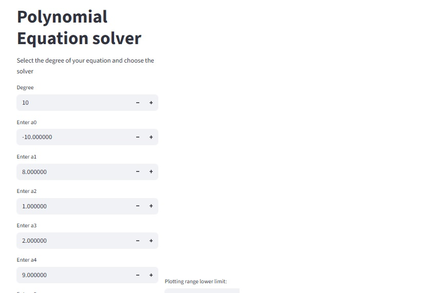
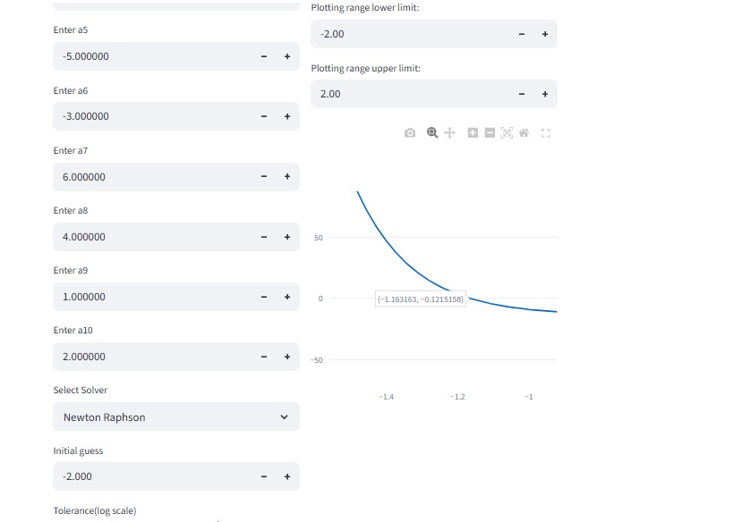
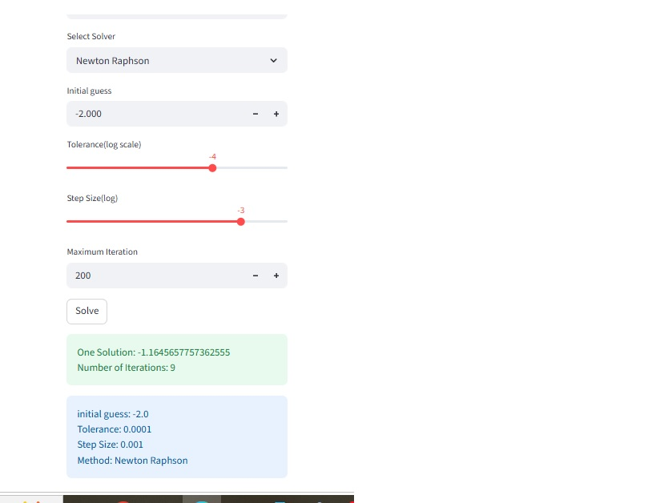

# Higher Order Polynomial Equation Solver
The <b>Abel-Ruffini Theorem</b> proves that polynomial equations with degrees higher than 5 cannot be solved analytically. The necessity of using numerical techniques instead arises here. This web application solves polynomial equations of any degree of the form: 
### 
<i>a0+a1x+a2x2+a3x3+..........+an-1xn-1+anxn = 0 </i>

 The user can input the coefficients and the degree of equation and solve it numerically using this application. 4 numerical methods are available here: 
1) Newton Raphson Method
2) Secant Method
3) Bisection Method
4) False Position Method(Regula Falsi)

The user can choose any of these methods to solve his equation. The algorithm parameters like tolerance, step size, maximum iterations,initial guess etc. are given by the user as well, allowing him to simulate and analyze the internal working of each numerical method by approaching the solution in various ways through varying these parameters. An interactive plot of the equation is also available, which can be used to view the behaviour of the equation as well as visualize the its solutions.The plot can be zoomed in and out and the x axis limits are defined by the user. 
<table>
  <tr>
    <td></td>
    <td></td>
    <td></td>
  </tr>
</table>

### Outputs
Once all the parameters are defined by the user, running the solver will give one of the solutions and the number iterations required for convergence. In case the system diverges(crosses maximum iteration limits), the application will return a message informing about the convergence failure. The user might try to increase the number of iterations or change the intial guesses/values and try to approach the solution again.   
For methods like bisection or regula falsi, the initial values x = (a,b) must be chosen such that f(a)*f(b)<0. The program will return a message telling the user about invalid initial values if this condition is not satisfied.

You can use the app here: 
https://higher-order-polynomial-equation-solver-ky5augvdon8rfzrjajiovi.streamlit.app/
